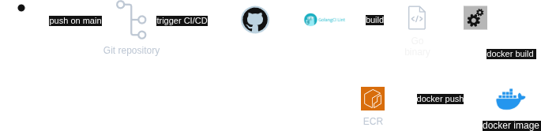

[](https://github.com/gpaolettig/books-api/actions/workflows/ci.yml)
# Books API
This is a simple RESTful API of books built using Go. allows you to perform two actions (get book by ID and get all books).  
This project have a CI/CD pipeline using Gh Actions to automate testing and deployment to AWS EC2 instance.
## Flowchart

## About the API
### Endpoints
#### Get All Books
```http
  GET /books
```
- **URL:** `/books`
- **Method:** `GET`
- **Description:** Retrieves a list of all books.
- **Response:**
    - **Status Code:** `200 OK` /
    - **Body:** JSON array of book objects.
#### Get Book by ID
```http
  GET /books/{id}
```
- **URL:** `/books/{id}`
- **Method:** `GET`
- **Description:** Retrieves a book by its ID.
- **URL Parameters:**
    - `id` (required): The ID of the book to retrieve.
- **Response:**
    - **Status Code:** `200 OK` if found, `404 Not Found` if not found.
    - **Body:** JSON object of the book.
##### Example Book Object
```json
{
  "id": "1",
  "title": "Clean Code",
  "author": "Uncle Bob",
  "isbn": "978-0132350884"
}
```